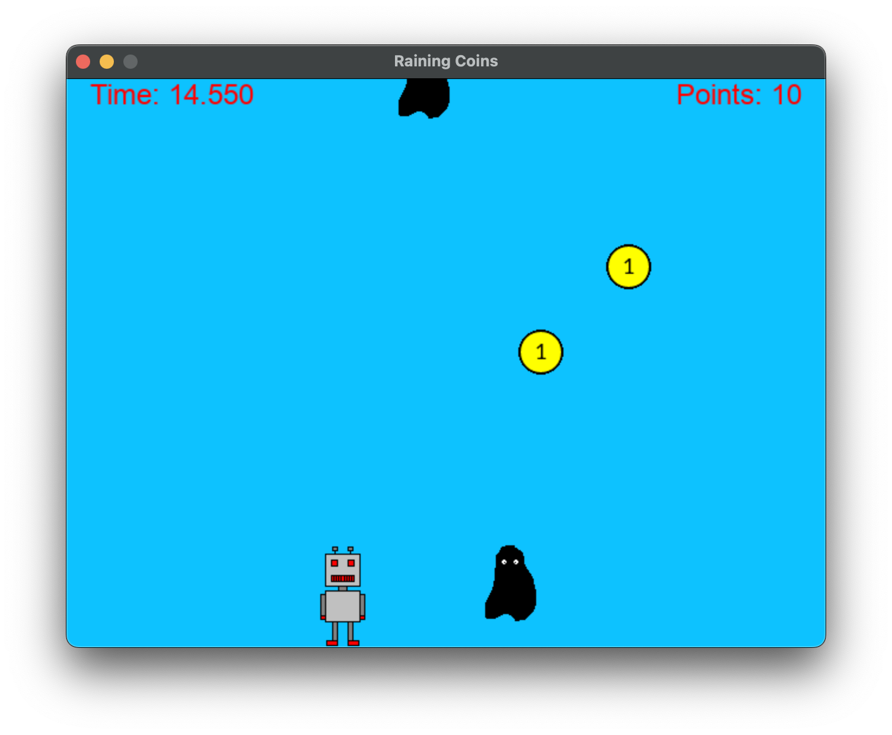

# Pygame Project for University of Helsinki's Python Programming MOOC 2022

Welcome to my Pygame project for the 2022 Helsinki Python Programming MOOC! The aim of this project was to create a simple (~200 lines of code) Pygame using only the assets provided.

In this game, your goal is to collect 30 points within a 40-second time limit while avoiding monsters that randomly spawn and fall down the screen. Each coin you touch adds 1 point to your score, but if you touch a monster, the game instantly ends. Can you collect 30 coins within the time limit? It may be harder than you think!

<p align="center">
  
</p>

## Installation

To play this game, you will need to have Pygame installed on your computer. You can install Pygame using pip by running the following command:

```console
pip3 install pygame
```

Alternatively, you can visit the Pygame website (https://www.pygame.org/) for more installation options.

## How to Play

- Use the left and right arrow keys to move the player character left and right.
- Collect as many coins as possible within the time limit. Each coin adds 1 point to your score. They fall from random locations so stay vigilant.
- Avoid the monsters! If you touch a monster, the game will end. They also fall randomly and at a faster speed than coins do!
- The game is over when the time limit is reached, if a monster is touched or if you collect 30 coins. Good Luck!
